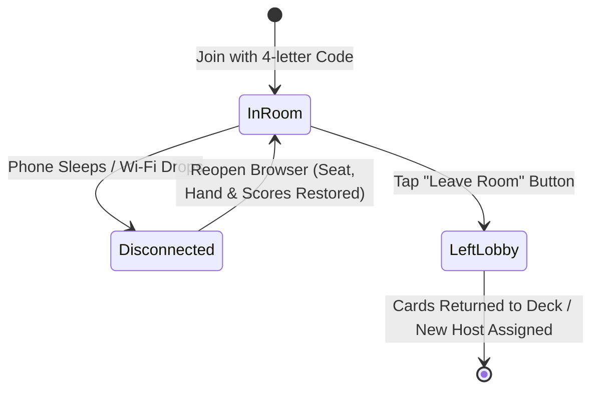

# BGH (Board Game Helper) 🎲🃏

A modern, mobile-first companion web application designed for players to run on their smartphones and laptops around a physical tabletop game.

It replaces the legacy `fdlm-scratch` with a modern, extensible, and completely game-agnostic architecture:
* **No hardcoded game logic**: Cards and rules are defined through generic Card Sets with dynamic metadata schemas.
* **Multi-device real-time sync**: Fast 4-letter room codes (e.g., `WORD`, `RING`) powered by WebSockets.
* **Mobile-first UX**: Dark mode interface designed for quick one-thumb interactions, privacy shields for secret cards, and instant phone sleep recovery.
* **Pre-seeded & ready to play**: Includes **170 cards** for *Fiesta de los Muertos* (accurately classified into 130 Base and 40 Custom cards) and **74 diverse rules** for *Things in Rings*.

---

## 📋 Table of Contents
1. [Core Architectural Concepts](#-core-architectural-concepts)
   - [Decked Metadata vs. Display-Only Metadata](#1-decked-metadata-vs-display-only-metadata)
   - [Dynamic Decks Engine & Full Default Splitting](#2-dynamic-decks-engine--full-default-splitting)
   - [Atomic State & Zero-Config Storage](#3-atomic-state--zero-config-storage)
   - [Room Lifecycle: Explicit Leave vs. Network Disconnect](#4-room-lifecycle-explicit-leave-vs-network-disconnect)
2. [Feature Breakdown](#-feature-breakdown)
   - [Decks, Private Hands & Shared Table Pool](#1-decks-private-hands--shared-table-pool)
   - [Universal 2D Scorekeeper Matrix](#2-universal-2d-scorekeeper-matrix)
   - [Turn Order Randomizer & Shared Dice Roller](#3-turn-order-randomizer--shared-dice-roller)
   - [Card Set Library & Wikipedia Auto-Enricher](#4-card-set-library--wikipedia-auto-enricher)
3. [Pre-Seeded Game Sets](#-pre-seeded-game-sets)
   - [Fiesta de los Muertos](#fiesta-de-los-muertos)
   - [Things in Rings](#things-in-rings)
4. [How to Play: Step-by-Step Walkthroughs](#-how-to-play-step-by-step-walkthroughs)
5. [Getting Started & Local Network Setup](#-getting-started--local-network-setup)
6. [Verification & Testing](#-verification--testing)
7. [Project Structure](#-project-structure)

---

## 🧠 Core Architectural Concepts

### 1. Decked Metadata vs. Display-Only Metadata
The framework avoids hardcoded card fields by categorizing all metadata fields into two types:

| Category | Definition | Behaviors | Examples |
| :--- | :--- | :--- | :--- |
| **Decked Metadata** (`isDecked: true`) | Properties intended to **partition cards into distinct decks** | <ul><li>Used by the server to group cards into separate draw piles.</li><li>**Always displayed on the card face** as styled badges/chips.</li><li>Configurable per set (`options`, `label`).</li></ul> | `Difficulty` (`easy`, `medium`, `hard`)<br>`Edition` (`Base`, `Custom`, `Expansion`)<br>`Level` (`1 star`, `2 stars`, `3 stars`)<br>`Category` (`Attribute`, `Word`, `Context`) |
| **Display-Only Metadata** (`isDecked: false`) | Fields intended strictly for visual card representation | <ul><li>Rendered on the card face or inside modals.</li><li>**Never used to split decks**.</li><li>Supports rich types: multilingual, images, links, or free-form text.</li></ul> | `Person Name` (Multilingual: EN, FR, JA)<br>`Portrait Image` (URL / Lightbox)<br>`Wikipedia Article` (Language links)<br>`Rule Description` (Text) |

#### Standardized Edition Field
`Edition` is treated as a standard decked metadata property across all sets. It supports:
- **`Base`**: Cards from the official base game.
- **`Custom`**: User-submitted or assistant-generated custom cards.
- **`Expansion (<name>)`**: Cards belonging to specific physical or community expansions (e.g., `Expansion (La Catrina)`).

---

### 2. Dynamic Decks Engine & Full Default Splitting
Instead of relying on rigid, pre-made decks, the backend dynamically calculates draw piles based on active decked metadata keys:

$$\text{Active Decks} = \prod_{k \in \text{deckGroupByKeys}} \text{distinctValues}(k)$$

* **All Splits Enabled by Default**: When a room is created or switched to a new set, **all decked metadata fields are selected by default** (`['difficulty', 'edition']` for FDLM; `['level', 'category', 'edition']` for Things in Rings). This produces the maximum number of granular decks immediately.
* **Instant Deck Splitting Controls**: Players can toggle any decked metadata field on or off with single-tap pills (`✓ Difficulty`, `✓ Edition`), or use 1-click presets:
  - **`Select All (Max Split)`**: Re-enables all metadata splits for maximum granularity.
  - **`Single Deck`**: Pools all cards together into one large draw deck.
* **Robust Alias Resolution**: The partitioning engine automatically resolves legacy property keys (such as `source` $\leftrightarrow$ `edition`) and performs case-insensitive lookups, preventing empty decks or `"Unknown"` deck labels.

---

### 3. Atomic State & Zero-Config Storage
* **Transactional JSON Datastore**: State is persisted in `server/data/` (`sets.json`, `cards.json`, `rooms.json`) using atomic write queues with retry locks.
* **Zero Race Conditions**: Card drawing, hand discards, and table pooling operations are executed atomically on the server. If two players tap "Draw Card" simultaneously, each player is guaranteed to receive a distinct, unique card.
* **Zero External DB Dependencies**: Runs completely locally without requiring MongoDB, PostgreSQL, or Docker.

---

### 4. Room Lifecycle: Explicit Leave vs. Network Disconnect



* **Explicit Leave (Top-Right Button)**:
  - The player is completely removed from `room.players`.
  - Any cards in their hand are automatically returned to the discard pile.
  - If the player was the **room host/owner**, ownership is automatically transferred to the next active player 👑.
  - Local storage is wiped, and the socket leaves the room channel. Connected players refreshing their screens will **never pull the departed player back in**.
* **Accidental Disconnect / Phone Sleep**:
  - If a player's phone sleeps or network drops, their player slot remains saved with `connected: false`.
  - Reopening the page automatically re-authenticates the player, restoring their private hand, scores, turn order, and distinct player color.
* **Distinct Player Colors**:
  - Player colors are allocated from a high-contrast palette (`#3b82f6` Blue, `#ef4444` Red, `#10b981` Green, `#f59e0b` Amber, `#8b5cf6` Purple, etc.).
  - The server always selects the first unused color in the active room, preventing duplicate color collisions even after earlier players leave and rejoin.
* **Host Moderation**:
  - The room owner or players can click the small `×` on any player pill in the header to kick disconnected players or clean up stale seats.

---

## 🎛️ Feature Breakdown

### 1. Decks, Private Hands & Shared Table Pool
* **Active Decks**: Shows remaining card counts with empty deck state protection. Tap **"Draw Card"** to draw directly into your hand.
* **Private Hand ("Tap to Peek")**:
  - Kept completely hidden from other table members.
  - Cards default to a secret face-down state (`EyeOff` privacy shield). Tap to reveal; tap again to conceal.
  - Actions per card: **Peek/Hide**, **To Pool** (face-down submission), **Return to Deck**, or **Discard**.
* **Shared Table Pool & Reveal Phase**:
  - **Submit Face-Down**: Players secretly submit their cards to the pool.
  - **Add Dummy / Noise Cards**: Anyone can tap "+ Add Dummy Cards" to draw $N$ unassigned cards from any deck directly into the pool face-down (essential for *Fiesta de los Muertos* deduction).
  - **Reveal All**: Shuffles player and dummy cards together and flips them face-up on all connected devices simultaneously.
  - **Zoom Lightbox**: Tap any portrait to view high-resolution historical images in a full-screen modal without head/face cropping.
  - **Direct Wikipedia Links**: Click any language badge (`EN`, `FR`, `JA`) to open the subject's canonical Wikipedia biography.

---

### 2. Universal 2D Scorekeeper Matrix
A generalized scoring table designed to work for any board game (e.g., *Flip 7*, *7 Wonders*, *Catan*, *Wingspan*):

* **Matrix Dimensions**: Rows = Players (online players + offline guests), Columns = Rounds or Categories.
* **Custom Columns**: Tap "+ Add Column" to create columns with custom labels (e.g. `Military`, `Science`, `Treasury`). Double-click or tap to rename/delete columns.
* **Quick Keypad**: Tap any cell to adjust points using convenient deltas (`+1`, `-1`, `+5`, `-5`, `+10`, `+15`, `0`) or input direct values.
* **Auto-Summing & Leader Highlights**: Automatically calculates column totals and row sums. The leading player is marked with a gold trophy 👑.
* **Offline Guests**: Tap "+ Guest" to add table players who do not have a phone.

---

### 3. Turn Order Randomizer & Shared Dice Roller
* **Turn Order Randomizer**:
  - Shuffles all connected room members into a numbered sequence (`#1 First Player 👑`, `#2`, `#3`, ...).
  - Direction Toggle: Switch between **Clockwise** and **Counter-Clockwise** table seating.
  - Synced live to all connected devices.
* **Shared Dice Roller**:
  - Roll any combination of standard polyhedral dice: **d4, d6, d8, d10, d12, d20, d100**.
  - Custom roll modifiers (`+` / `-`).
  - Animated live roll feed with timestamps, individual die roll values, and totals broadcasted to all room members in real time.

---

### 4. Card Set Library & Wikipedia Auto-Enricher
* **Multi-Attribute Filter Rows**:
  - The Card Set Library dynamically renders dedicated filter rows for **every decked metadata field** on the active set (`Difficulty`, `Edition`, `Level`, `Category`).
  - Combine filters with real-time text search across titles, descriptions, and language translations.
  - Quick **"Reset Filters"** action when any filters are active.
* **Card Creator with Wikipedia Auto-Fill**:
  - Add new cards to any set at any time.
  - For multilingual sets: Type a person or subject name in English, French, or Japanese and tap **"Auto-fill"**.
  - The backend queries the Wikipedia MediaWiki API to automatically populate:
    1. Canonical multilingual names (🇺🇸 English, 🇫🇷 French, 🇯🇵 Japanese)
    2. Wikipedia article URLs
    3. Official high-resolution thumbnail images

---

## 🗃️ Pre-Seeded Game Sets

### Fiesta de los Muertos
* **Total Cards**: 170 cards.
* **130 Official Base Game Cards**: Accurately verified against the original vanilla database dump (`20210622(Vanilla).json`), featuring historical figures (e.g., *Cleopatra*, *Napoleon Bonaparte*, *Albert Einstein*, *Marie Curie*, *Mozart*, *Leonardo da Vinci*).
* **40 Custom Cards**: Community and modern figures (e.g., *Emmanuel Macron*, *Spider-Man*, *Super Mario*, *Doraemon*, *Marilyn Monroe*).
* **Decked Metadata**:
  - `Difficulty`: `easy`, `medium`, `hard`
  - `Edition`: `Base`, `Custom`, `Expansion (<name>)`

### Things in Rings
* **Total Rules**: 74 secret Venn diagram rules.
* **Rule Categories**:
  - **Attribute** (e.g., *"Made primarily of metal"*, *"Can easily fit in a shoe box"*, *"Typically green"*).
  - **Word** (e.g., *"Name contains exactly two syllables"*, *"Starts with a vowel"*, *"Spelled with 4 or fewer letters"*).
  - **Context** (e.g., *"Found in a classroom"*, *"Requires electricity to function"*, *"Associated with summer"*).
* **Decked Metadata**:
  - `Difficulty Level`: `1 star`, `2 stars`, `3 stars`
  - `Rule Category`: `Attribute`, `Word`, `Context`
  - `Edition`: `Custom` (All 74 community/assistant-authored rules)

---

## 🎲 How to Play: Step-by-Step Walkthroughs

### 1. Playing *Fiesta de los Muertos*
1. **Create Room**: One player opens the webapp, types their name, and creates a room with **Fiesta de los Muertos**.
2. **Join Lobby**: Other players open the app on their phones, enter their name, and type the 4-letter room code (e.g., `FD42`).
3. **Draw Cards**: Each player draws 1 card from their preferred deck (e.g., `Easy | Base` or `Medium | Base`).
4. **Secret Clue**: Tap to peek at your secret figure and write your physical clue on your board.
5. **Submit to Pool**: Tap **"To Pool"** on your drawn card to submit it face-down to the shared table pool.
6. **Add Dummy Cards**: A player taps **"Add Dummy Cards"**, selects a deck, and adds 2–4 unassigned cards face-down into the pool.
7. **Reveal Phase**: Tap **"Reveal All"**. The server shuffles all player cards and dummy cards together and reveals them face-up on all screens with flags and Wikipedia links for the table deduction phase.
8. **Next Round**: Tap the circular reset icon in Table Pool to clear the pool and prepare for the next round.

### 2. Playing *Things in Rings*
1. **Create or Switch Set**: In the room or header, select **Things in Rings**.
2. **Configure Splits**: Decks are automatically split by `Level | Category | Edition` (`1 star | Attribute | Custom`, `2 stars | Word | Custom`, etc.). Uncheck any pill if you want broader decks.
3. **The Knower**: The player acting as "The Knower" draws the required number of rule cards (e.g., one 1-star, one 2-star, one 3-star) into their private hand.
4. **Placement**: The Knower keeps their rules hidden on their phone while other players place physical object cards into the overlapping rings, giving "yes/no" answers based on their hidden rules.

---

## 🚀 Getting Started & Local Network Setup

### Quick Launch (Windows)
Double-click `run.bat` in the project root:
```bat
run.bat
```
This automatically sets up Node.js paths, starts the backend server on port `3001`, and launches the Vite frontend on port `5173`.

---

### Manual Launch (Terminal)
Ensure Node.js (v18+) is installed:

```bash
# 1. Install dependencies
npm --prefix server install
npm --prefix client install

# 2. Terminal A: Start Backend (Port 3001)
npm --prefix server run dev

# 3. Terminal B: Start Frontend (Port 5173)
npm --prefix client run dev
```

---

### Accessing on Phones Over Wi-Fi
1. Ensure your phone and PC are connected to the same local Wi-Fi network.
2. Find your computer's local IP address (e.g., `192.168.1.106` via `ipconfig` on Windows).
3. On your phone's browser, navigate to:
   ```
   http://<YOUR_COMPUTER_IP>:5173
   ```
   *(e.g., `http://192.168.1.106:5173`)*
4. Create or join a room and start playing!

---

## 🧪 Verification & Testing

The project includes unit, integration, and full real-time multi-client end-to-end tests:

```bash
# Run server test suite
npm --prefix server test

# Verify client production build
npm --prefix client run build
```

### Test Coverage Highlights
* **Suite 1: Integration & Domain Logic**
  - Database seed validation (130 Base vs. 40 Custom FDLM cards; 74 Custom Things in Rings rules).
  - Dynamic deck partitioning across all decked metadata combinations.
  - Key alias resolution (preventing `"Unknown"` decks).
  - Default full deck splitting on room creation and set switching.
  - Multi-client card drawing race condition immunity.
  - Universal scorekeeper matrix cell arithmetic and leader calculation.
  - Explicit room leaving, host transfer, and player color collision prevention.
* **Suite 2: Multi-Client Real-Time Socket E2E**
  - Simulated multi-client join, secret draws, face-down pool submissions, dummy card additions, pool reveals, live score sync, and dice broadcast feeds.

---

## 📁 Project Structure

```
bgh/
├── client/                          # React + TypeScript + Tailwind CSS Frontend
│   ├── src/
│   │   ├── components/
│   │   │   ├── common/
│   │   │   │   ├── CardDisplay.tsx  # Dynamic card face, decked badges & lightbox
│   │   │   │   └── Navbar.tsx       # Bottom mobile tab navigation
│   │   │   ├── decks/
│   │   │   │   ├── DeckExplorer.tsx # Active decks, draw actions & split controls
│   │   │   │   ├── PlayerHand.tsx   # Private hand with tap-to-peek privacy
│   │   │   │   └── TablePool.tsx    # Face-down shared pool, dummy cards & reveal
│   │   │   ├── lobby/
│   │   │   │   ├── JoinRoomModal.tsx# Create / Join room dialog
│   │   │   │   └── LobbyHeader.tsx  # 4-letter code, player pills, leave button
│   │   │   ├── scorekeeper/
│   │   │   │   └── ScoreTable.tsx   # 2D scoring matrix with delta keypad & leader
│   │   │   ├── sets/
│   │   │   │   ├── CardFormModal.tsx# Card creator with Wikipedia auto-enricher
│   │   │   │   └── SetManager.tsx   # Card set library with decked metadata filters
│   │   │   └── tools/
│   │   │       ├── DiceRoller.tsx   # Polyhedral dice roller & room feed
│   │   │       └── TurnOrder.tsx    # Seating randomizer (clockwise / counter)
│   │   ├── context/
│   │   │   └── SocketContext.tsx    # Real-time WebSocket connection state
│   │   ├── types/
│   │   │   └── index.ts             # Shared frontend type definitions
│   │   ├── App.tsx
│   │   └── main.tsx
│   └── vite.config.ts
│
├── server/                          # Node.js + Express + Socket.io Backend
│   ├── data/                        # Persistent JSON datastore (zero-config)
│   │   ├── sets.json                # CardSet definitions & metadata schemas
│   │   ├── cards.json               # Seeded & user-created cards
│   │   └── rooms.json               # Active game lobbies and player state
│   ├── src/
│   │   ├── db/
│   │   │   ├── seed.ts              # Data seeding & migration logic
│   │   │   └── store.ts             # Transactional atomic JSON store
│   │   ├── rooms/
│   │   │   └── roomManager.ts       # Room lifecycle, atomic draws, deck engine
│   │   ├── routes/
│   │   │   ├── setRoutes.ts         # REST API for CardSets and Cards
│   │   │   └── wikiRoutes.ts        # Wikipedia MediaWiki enrichment API
│   │   ├── test/
│   │   │   ├── server.test.ts       # Unit & integration test suite
│   │   │   └── e2e.test.ts          # Real-time multi-client socket E2E suite
│   │   ├── types/
│   │   │   └── index.ts             # Backend type definitions
│   │   └── index.ts                 # Express app & Socket.io server entry
│   └── tsconfig.json
│
├── run.bat                          # One-click Windows startup script
└── README.md                        # Documentation
```

---

## 📄 License
MIT License. Built for tabletop enthusiasts. Free to use, adapt, and expand for any board game!
